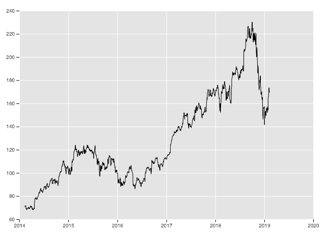
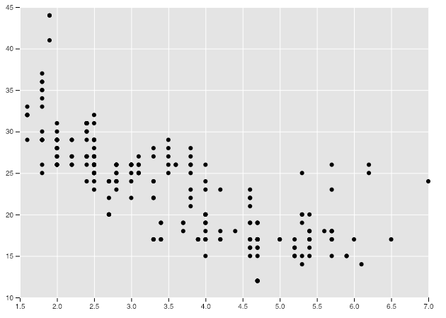
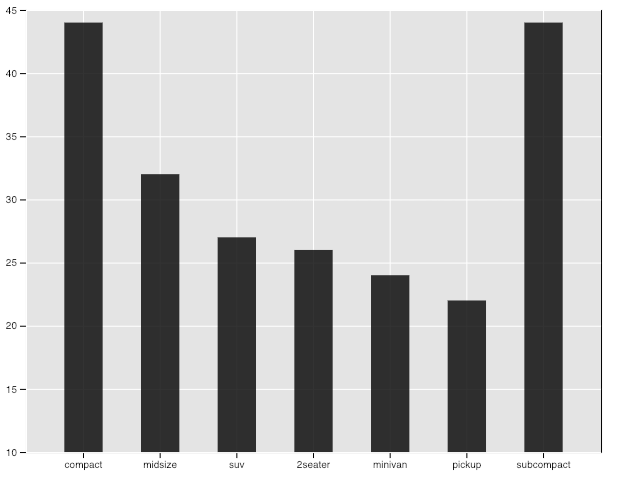
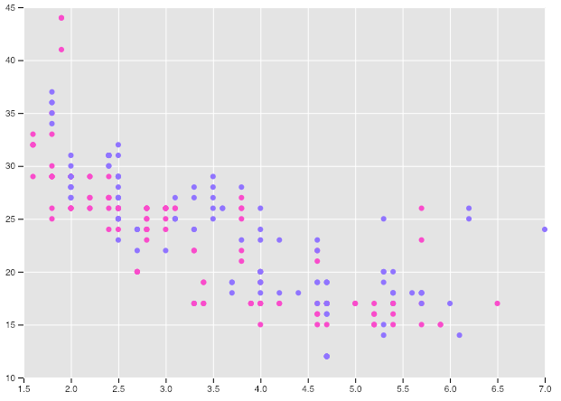
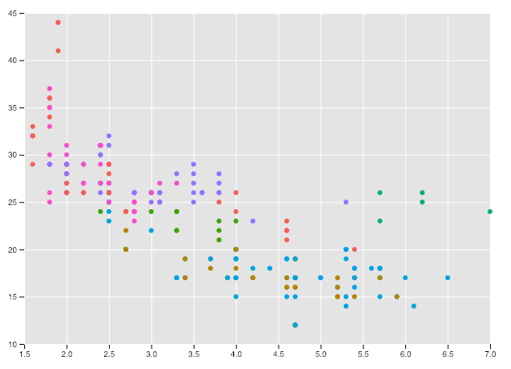
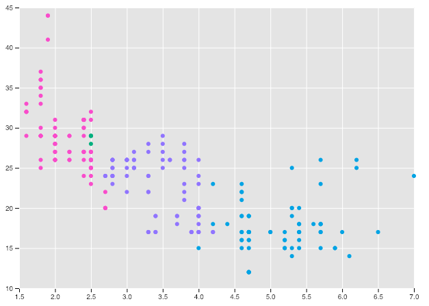

# react-d3-ggplot
+ Using React.js and D3.js to build simple and reusable components for data visualizations on the web.
```zsh
# yarn
yarn add react-d3-ggplot

# npm
npm install react-d3-ggplot
```

# Demos







# Introduction
+ Before we look at some examples, we first need to talk about our data. The structure of our data is important to get right the first time because this will make it easier to work with.

## 1. We must first format our data as an array of objects
+ Each object in the array can have as many properties as you want, as long as the object "lengths" match and the property names match.
```js
// here's an example of a valid format
const data = [
    { experience: 3, pay: 1000, hrs: 65 }, // The "length" of each object is 3.
    { experience: 7, pay: 3000, hrs: 100 } // And each object has the same properties: experience, pay, and hrs.
];

// remarks on using dates
const someOtherData = [
    { experience: 3, pay: 1000, hrs: 65, date: new Date("01-01-2010") }, // When using dates, they must be formatted as
    { experience: 7, pay: 3000, hrs: 100, date: new Date("01-07-2018") } // valid JavaScript date objects, as in this example.
];
```

## 2. The main component in `react-d3-ggplot` is `<GGPLOT/>`
+ `<GGPLOT/>` will only render the `x-axis` and `y-axis`.
+ It is up to you to choose one of the following `geoms` (geometric object):
    + Points
    + Line
    + Rects

+ `<GGPLOT/>` has 3 main props that are required

| Prop            | Required | Description                                                                               |
|-----------------|----------|-------------------------------------------------------------------------------------------|
| data            | true     | `data` must be an array of objects                                                        |
| aes (aesthetic) | true     | `aes` must be an array containing two strings: "x-value" and "y-value"                    |
| dimensions      | true     | `dimensions` must be an object with three properties: width, height, and padding. |

## 3. Using react-d3-ggplot library
```js
import React         from "react";
import { Component } from "react";

// We need to bring in <GGPLOT/>
import { GGPLOT } from "react-d3-ggplot";

// Then we import the type of plot we want: Rects (for barplots), Points (for scatterplots), and Line (for line charts)
import { Points } from "react-d3-ggplot";

class ScatterPlot extends Component{
    state = {
        data: [
            { experience: 3, pay: 1000, hrs: 65, date: new Date("01-01-2010") },
            { experience: 7, pay: 3000, hrs: 100, date: new Date("01-01-2020") }
        ],
        aes: ["experience", "pay"], // Choose x-values and y-values directly from data. (Must pass in x first and y second)
        dimensions: { width: 600, height: 400, padding: 50 } // Finally, choose the dimensions of your graph.
    }

    render(){
        return(
            <GGPLOT { ...this.state } >
                <Points/>
            </GGPLOT>
        );
    }
}
```

## 4. As we can see, the workflow is always the same when using `<GGPLOT/>` to create graphs
+ Define our data
+ Select the aes (the x-value and y-value)
+ Set the dimensions of the graph

# Live Example
+ https://codesandbox.io/s/p9wrv4moz7
```js
import React         from "react";
import { Component } from "react";
import { GGPLOT }    from "react-d3-ggplot";
import { Line }      from "react-d3-ggplot";

class LineChart extends Component {
    state = {
        data: [],
        aes: ["date", "close"],
        dimensions: {
            width: window.innerWidth*0.8,
            height: window.innerHeight*0.8,
            padding: 50
        }
    }

    resizeChart = () => {
        this.setState({
            dimensions: {
                ...this.state.dimensions,
                width: window.innerWidth*0.8,
                height: window.innerHeight*0.8,
            }
        });
    }

    render(){
        if(this.state.data.length === 0)
            return <h1>Loading....</h1>;

        return(
            <GGPLOT { ...this.state }>
                <Line/>
            </GGPLOT>
        );
    }

    componentDidMount(){
        // add resizeChart event listener
        window.addEventListener("resize", this.resizeChart);

        // fetch data from IEX api
        fetch("https://api.iextrading.com/1.0/stock/aapl/chart/5y")
            .then(res => res.json())
            .then(data => {
                // format date to JS date objects
                const formattedData = data.map(item => ({
                    ...item,
                    date: new Date(item.date)
                }));
                // update state with correctly formatted data 
                this.setState({ data: formattedData });
            });
    }

    componentWillUnmount() {
        // remove resizeChart event listener
        window.removeEventListener("resize", this.resizeChart);
    }
}
```
