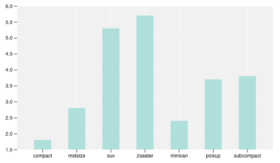
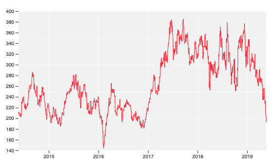

<h1 align="center">react d3 ggplot</h1>
<p align="center">Using React.js, TypeScript, and D3.js to build simple and reusable components for data visualizations on the web.</p>

<p align="center">
  
  
  
  
</p>

# Demos

<p align="center">
  
  
  
</p>

# Getting Started

## Install

```zsh
# yarn
yarn add react-d3-ggplot

# npm
npm install react-d3-ggplot
```

## Example

| Props            | Description                       |
| ---------------- | --------------------------------- |
| data             | An array of objects               |
| aes (aesthetics) | An array with two strings         |
| dimensions       | An object: width, height, padding |

```js
import React from "react";
import { useState } from "react";
import { GGPLOT } from "react-d3-ggplot";
import { Line } from "react-d3-ggplot";

const LineChart = () => {
  const [state, setState] = useState({
    data: [{ x: 0, y: 0 }, { x: 10, y: 10 }],
    aes: ["x", "y"],
    dimensions: { width: 500, height: 300, padding: 50 }
  });

  return (
    <GGPLOT {...state}>
      <Line />
    </GGPLOT>
  );
};
```

# Documentation

- [Current Documentation](https://www.npmjs.com/package/react-d3-ggplot/v/1.0.32#introduction)

- Official Documentation `[in progress]`
- Contributing as an experienced developer `[in progress]`
- Contributing as a beginner `[in progress]`
- Goal of the project `[in progress]`

# Live Example

- https://codesandbox.io/s/p9wrv4moz7
